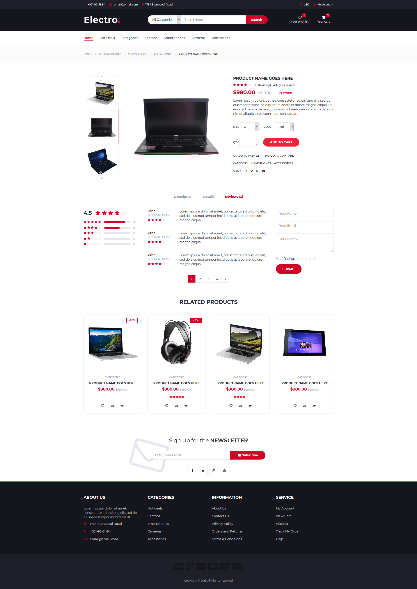
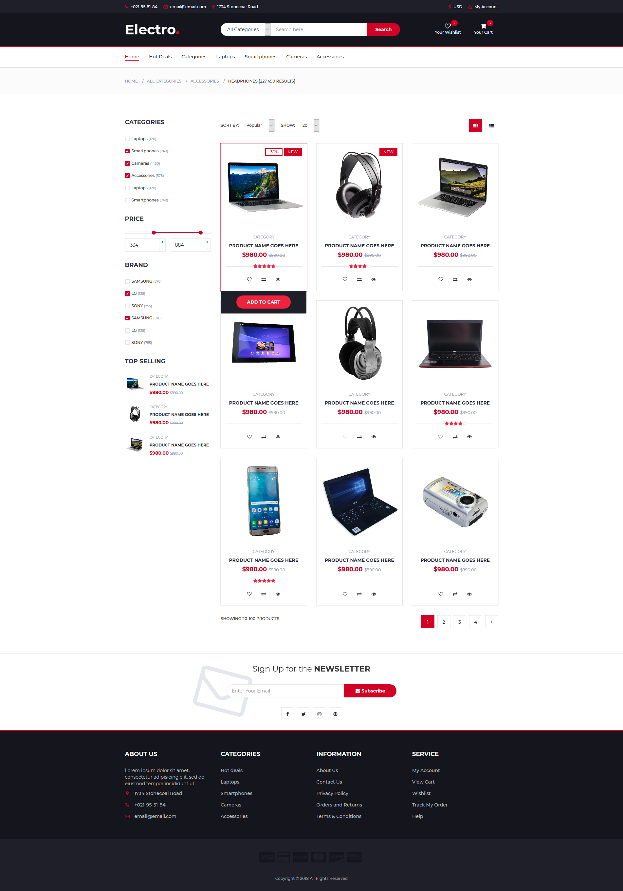
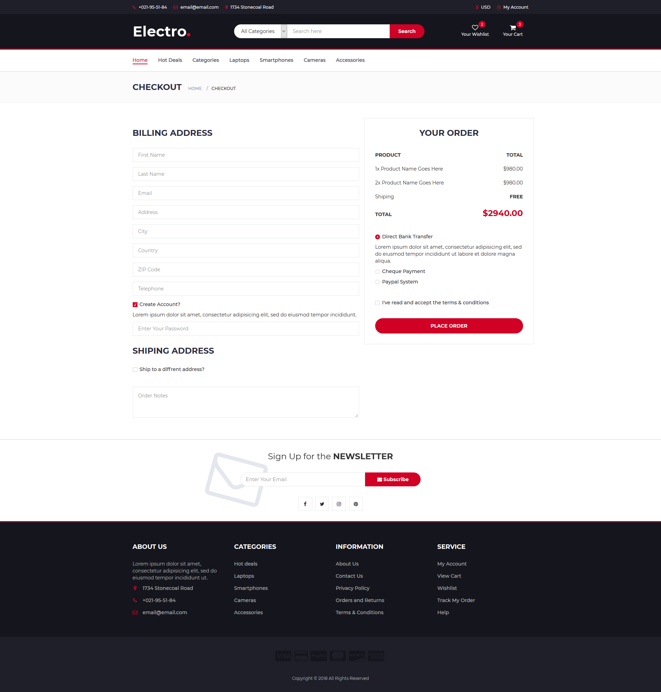
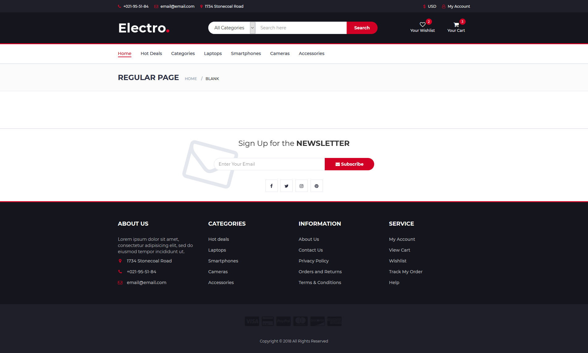

## Full E-commerce Website (PHP, PDO, MySQL)

Repository: `Full-E-commerce-in-PHP-PDO-MySQL`

A complete educational/demo e‑commerce website built with PHP (PDO) and MySQL, featuring a storefront and an admin panel with CRUD for products, categories, orders, users, and more. This project is intended for learning purposes and is not production‑ready without additional security hardening.

### Quick Links
- Frontend: `http://localhost/ecommerce`
- Admin Panel: `http://localhost/ecommerce/admin`
- Database schema: `Database SQL/db_shop.sql`

---

## Overview
This project demonstrates a full e‑commerce flow: browsing products, categories, cart, checkout, user accounts, and an admin panel to manage catalog and orders. It uses direct PHP pages (no routing framework) and PDO for database connectivity. Static assets live under `css/` and `js/`, and it runs via a standard Apache/PHP stack (Laragon/XAMPP).

## Features
- Product catalog with categories and subcategories
- Product details, reviews/ratings UI
- Cart and basic checkout/orders
- Search and newsletter UI components
- Admin CRUD: brands, categories, subcategories, products, users, orders, notifications
- Google Map embedded in footer (replace API key as needed)
- Homepage "Load More" for latest and top-selling lists via inline scripts in `index.php`
- Optional product carousels/widgets (Slick), price slider (noUiSlider)

## Tech Stack
- **Backend**: PHP 7.3+ (PDO), MySQL 5.7+
- **Frontend**: Bootstrap, jQuery, Slick, noUiSlider, Font Awesome
- **Server**: Apache (Laragon or XAMPP on Windows)

## Folder Structure
```text
ecommerce/
  admin/                # Admin panel (CRUD, dashboards)
    include/            # Header, footer, auth, config, process
  css/, js/, fonts/     # Frontend assets
  include/              # Frontend header/footer
  Database SQL/         # SQL dump (db_shop.sql)
  uploads/              # Uploaded product images
  index.php             # Homepage
  product.php           # Product details
  store.php             # Store/category listing
  checkout.php          # Checkout flow
  login.php, register.php, logout.php
```

## Getting Started

### Prerequisites
- PHP 7.3+ with PDO extension enabled (PHP 8+ works; update compatibility as needed)
- MySQL 5.7+
- Apache (Laragon or XAMPP on Windows)

### Setup
- Laragon (Windows): Place this folder under `C:\laragon\www`, start Apache/MySQL, visit `http://localhost/ecommerce`.
- XAMPP (Windows): Place the folder under `C:\xampp\htdocs`, start Apache/MySQL, visit `http://localhost/ecommerce`.

No special routing or `.htaccess` is required; the project uses direct PHP files.

### Database Import
1. Create a database, e.g., `db_shop`.
2. Import the SQL dump: `Database SQL/db_shop.sql` (via phpMyAdmin or CLI).

### Configuration
Set database credentials in `admin/include/config.php`. Example:
```php
$dsn = 'mysql:host=127.0.0.1;dbname=db_shop;charset=utf8mb4';
$dbUser = 'root';
$dbPass = '';
```

Ensure `uploads/` is writable for product images.

If using the Google Map in the footer, replace the API key in the footer with your own or remove the map script.

## Usage

### Frontend
- Browse products on `index.php`, `store.php`, and `product.php`.
- Add to cart, proceed to `checkout.php`.
- Login/register via `login.php` and `register.php`.

Slick and noUiSlider are initialized in `js/main.js`. Carousels and UI widgets are optional.

### Admin Panel (`/admin`)
- Visit `http://localhost/ecommerce/admin`.
- There are no hardcoded admin credentials. Create or edit a user in the DB and set `role = 1` to grant admin.
- Manage brands, categories, subcategories, products, orders, users, and notifications.

## Screenshots






## Sample Data (Optional Seeders)
Optional SQL seed data is available for quick setup: products, orders, users, categories, subcategories, cart, reviews, and notifications. You can insert sample rows directly via phpMyAdmin using your own data or extend the provided schema in `Database SQL/db_shop.sql`.

Example insert (products):
```sql
INSERT INTO products (name, price, category_id, created_at)
VALUES ('Sample Product', 1999, 1, NOW());
```

## Architecture Notes
- The project uses an `auth` class with methods for CRUD across users, categories, subcategories, products, orders, cart, reviews, notifications, and locations.
- Admin operations are orchestrated via `admin/include/process.php`.
- Homepage uses inline scripts to implement a simple Load More for latest and top-selling lists in `index.php`.

## Security Notes (Read Me!)
- This is for educational/demo purposes, not production. It requires security hardening before real deployment.
- Passwords in demos may be stored in plain text; in production, use `password_hash(...)`/`password_verify(...)`.
- Sanitize and validate all inputs; use prepared statements for all queries.
- Add CSRF tokens to forms, validate file uploads (type/size), and move secrets (DB creds, API keys) to environment variables or a `.env` file.

## Troubleshooting
- DB connection errors: verify credentials in `admin/include/config.php` and that MySQL is running.
- Missing tables: import `Database SQL/db_shop.sql`.
- Images not showing: ensure files are in `uploads/` and the folder is writable.
- Google Map key invalid: replace with your own API key or remove the map script.
- On Windows (Laragon), line ending warnings about CRLF can be ignored.

## Roadmap / Potential Improvements
- Password hashing and secure authentication flows
- CSRF tokens on all forms
- Prepared statements for every input path
- Image validation and secure upload handling
- Environment variables for secrets (`.env`), separate config per environment
- Docker setup for reproducible local dev
- Unit/integration tests
- Optional payment integration (Stripe/PayPal) — not included in this demo

## Contribution
Contributions are welcome. Please open an issue or pull request with a clear description of changes.

## License
MIT License. See `LICENSE` if provided. Otherwise, assume MIT for this demo.

## Acknowledgements
- Styles inspired by the Electro template and third‑party packages used (Bootstrap, jQuery, Slick, noUiSlider, Font Awesome).

## Contact & Support
- Email: [mailto:Umarpak995@gmail.com](mailto:Umarpak995@gmail.com)
- LinkedIn: [`https://linkedin.com/in/umar444`](https://linkedin.com/in/umar444)

### Buy Me a Coffee
[Buy Me a Coffee](https://www.buymeacoffee.com/umar444)

If you’d like to sponsor or collaborate, feel free to reach out via email or LinkedIn.
